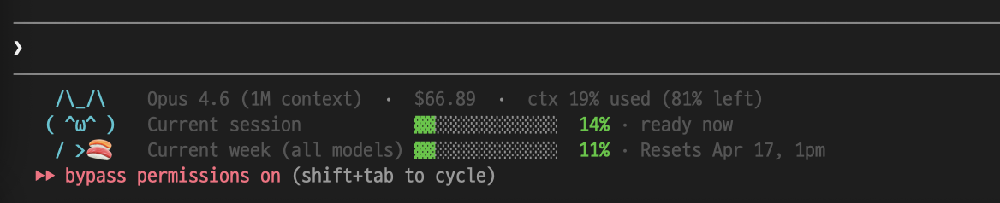

# 🐾 claude-cat

> Claude Code 상태 표시줄에 귀여운 고양이가 살며 남은 크레딧을 한눈에 알려줍니다.

[English README →](./README.md)

  

<p align="center">
  
  <br />
  <em>3줄 kawaii 카드 — <code>--full --kawaii</code></em>
</p>

claude-cat 은 Claude Code 가 statusLine 스크립트에 이미 넘겨주는 JSON 을 예쁘게 렌더링합니다. API 키도, OAuth 토큰도, 외부 네트워크도 안 씁니다. 그냥 고양이.

## 설치

모드 골라서 아래 프롬프트를 Claude Code 에 붙여넣으면 끝. Claude 가 `~/.claude/settings.json` 을 수정해주며, 다른 키는 안 건드리고 diff 를 먼저 보여줍니다. Claude Code 재시작하면 다음 턴부터 보입니다.

### A) ⭐ 기본 — compact, 한 줄 *(추천)*

깔리는 것: 한 줄에 사용량 바 + `$` 비용 + `ctx %`. 고양이 없음. 좁은 터미널에선 자동 줄바꿈.

```
5h ▓▓▓▓░░░░░░ 47% (1h 19m)  |  week ▓▓▓░░░░░░░ 31% (Fri 1pm)  |  $37.37  |  ctx 20%
```

```text
Install claude-cat (https://github.com/thingineeer/claude-cat) into my
~/.claude/settings.json as the statusLine.

- command: "npx -y claude-cat@latest"
- padding: 1
- refreshInterval: 600

Don't touch any other key. Show me the diff first.
```

### B) 3줄 kawaii 고양이

깔리는 것: 3줄 카드 — 왼쪽엔 ASCII 고양이, 오른쪽엔 데이터 행. 사용량에 따라 얼굴과 소품이 바뀝니다.

```
 /\_/\    Opus 4.6  ·  $38.52  ·  ctx 23% used (77% left)
( ^ω^ )   Current session            ▓▓▓▓▓▓░░░░░░░  51% · 1h 15m
 / >🍣    Current week (all models)  ▓▓▓░░░░░░░░░░  31% · Resets Apr 17, 1pm
```

```text
Install claude-cat (https://github.com/thingineeer/claude-cat) into my
~/.claude/settings.json as the statusLine.

- command: "npx -y claude-cat@latest --full --kawaii"
- padding: 1
- refreshInterval: 600

Don't touch any other key. Show me the diff first.
```

<details>
<summary>전체 모드 한눈에 보기</summary>

설치 방식은 같고 `command` 값만 바꾸면 됩니다.

<table>
<thead>
<tr><th>플래그</th><th>명령어</th><th>미리보기</th></tr>
</thead>
<tbody>
<tr>
<td><strong>⭐ (기본값)</strong></td>
<td><code>npx -y claude-cat@latest</code></td>
<td><pre>5h ▓░░░░░░░░░ 10% (3h 21m)  |  week ▓▓░░░░░░░░ 18% (Fri 1pm)  |  $0.123</pre></td>
</tr>
<tr>
<td><code>--full --kawaii</code></td>
<td><code>npx -y claude-cat@latest --full --kawaii</code></td>
<td><pre> /\_/\   Opus 4.6 · $0.123
( ^ω^ )  session  ▓░░░░░░░░░░░░░ 10% · 3h 21m
 / >🍣   week     ▓▓▓░░░░░░░░░░░ 18% · Resets Apr 17, 1pm</pre></td>
</tr>
<tr>
<td><code>--full</code></td>
<td><code>npx -y claude-cat@latest --full</code></td>
<td><pre>/ᐠ ^ᴥ^ ᐟ\  Opus 4.6 · $0.123
session  ▓░░░░░░░░░░░░░ 10% · 3h 21m
week     ▓▓▓░░░░░░░░░░░ 18% · Resets Apr 17, 1pm</pre></td>
</tr>
<tr>
<td><code>--wide</code></td>
<td><code>npx -y claude-cat@latest --wide</code></td>
<td><pre>5h ▓░░░░░░░ 10% (3h 21m)  |  week ▓░░░░░░░ 18% (Fri 1pm)  |  $0.123</pre></td>
</tr>
<tr>
<td><code>--full --no-cat</code></td>
<td><code>npx -y claude-cat@latest --full --no-cat</code></td>
<td><pre>Opus 4.6 · $0.123
session  ▓░░░░░░░░░░░░░ 10% · 3h 21m
week     ▓▓▓░░░░░░░░░░░ 18% · Resets Apr 17, 1pm</pre></td>
</tr>
</tbody>
</table>

전체 플래그/환경변수: 영문 README 참조.

</details>

## 출력 읽는 법

```
5h ▓▓▓▓░░░░░░ 47% (1h 19m)  |  week ▓▓▓░░░░░░░ 31% (Fri 1pm)  |  $37.37  |  ctx 20%
```

| 칩 | 의미 |
| --- | --- |
| `5h` / `week` / `sonnet` | rate-limit 창 (5시간 세션 / 주간 / 모델별 주간) |
| `▓▓▓▓░░░░░░` | 10칸 진행 바 — 초록 → 노랑 → 빨강 |
| `47%` | 정확한 퍼센트 |
| `(1h 19m)` / `(Fri 1pm)` | 리셋까지 — 세션은 상대, 주간은 절대 |
| `$37.37` | **이 세션의 누적 비용 (USD)** — 아래 설명 |
| `ctx 20%` | 현재 대화의 컨텍스트 사용률 |

### `$37.37` 이 무엇이고 — 무엇이 아닌지

**이 Claude Code 세션의 누적 비용** 입니다 (`cost.total_cost_usd`).

- ❌ 플랜 초과 "Extra usage" 요금 **아님** (다른 개념, statusLine 에 안 옴)
- ❌ 월 구독료 **아님**
- ❌ Pro/Max 면 지금 빠져나가는 돈 **아님** (정액제 — 참고용 숫자)
- ✅ **API key** 모드면 실제 비용. **Bedrock / Vertex** 에선 `$0.00` 고정

## 고양이 mood

고양이는 `--full` 모드에서만 나옵니다. 6가지 — 5개는 사용률, 1개(resting)는 상태 기반.

| 상태 | `--full` (1줄 face) | `--full --kawaii` 소품 |
| ---- | ------------------- | ---------------------- |
| 대기 중 *(resting)* | `/ᐠ -ᴥ- ᐟ\` | 🚬 담배 |
| 0–30 % *(chill)* | `/ᐠ ^ᴥ^ ᐟ\` | 🍣 초밥 |
| 30–60 % *(curious)* | `/ᐠ •ᴥ• ᐟ\` | ⌨️ 키보드 |
| 60–85 % *(alert)* | `/ᐠ ◉ᴥ◉ ᐟ\` | ☕ 커피 |
| 85–95 % *(nervous)* | `/ᐠ ⊙ᴥ⊙ ᐟ\` | 💤 휴식 |
| 95 %+ *(critical)* | `/ᐠ ✖ᴥ✖ ᐟ\` | 🛌 기절 |

## 플랜별 호환

| 플랜 | 표시 | 비고 |
| ---- | ---- | ---- |
| Claude Pro / Max | 사용률 바, 리셋 카운트다운, 고양이, 세션 비용 | `rate_limits` 는 첫 응답 이후 등장 |
| Anthropic API 키 | 세션 비용 + 고양이 | rate_limits 없음 |
| Bedrock / Vertex | 비용 `$0.00` 고정 | 상위 제약 |

## 개발·기여

```bash
git clone https://github.com/thingineeer/claude-cat.git
cd claude-cat
git config core.hooksPath .githooks
npm run test:sample
```

기여 가이드: [CONTRIBUTING.md](./CONTRIBUTING.md).

## 라이선스

MIT © thingineeer
