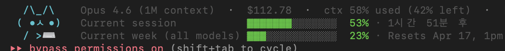
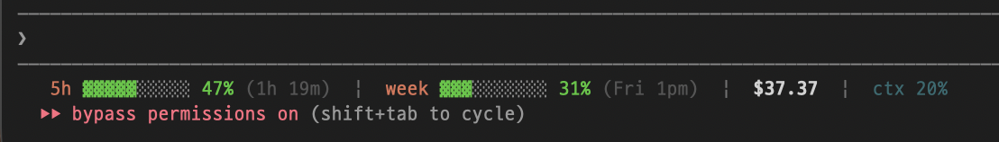

# 🐾 claude-cat

<p align="left"></p>

> A cute cat lives on your Claude Code status line and tells you how much usage you have left — at a glance.

[한국어 README →](./README.ko.md)

  

<p align="center">
  
  <br />
  <em>3-row kawaii card — <code>--full --kawaii</code>, Korean locale</em>
</p>

## Pick your mode

All modes read the same stdin JSON Claude Code pipes to statusLine
scripts. Swap the `command` field in `~/.claude/settings.json`:

| mode                          | one-line command                                      | cat?       |
| ----------------------------- | ----------------------------------------------------- | ---------- |
| **default** — compact, 1 line | `npx -y claude-cat@latest`                            | no         |
| `--wide` — 1 line, no wrap    | `npx -y claude-cat@latest --wide`                     | no         |
| `--full` — multi-row          | `npx -y claude-cat@latest --full`                     | 1-line face |
| `--full --kawaii` — 3-row     | `npx -y claude-cat@latest --full --kawaii`            | 3-row card  |
| `--full --no-cat` — pure data | `npx -y claude-cat@latest --full --no-cat`            | no         |

Each mode below shows a live sample plus the exact `settings.json`
block — copy/paste the one you want.

## Modes

### 1. Default — compact, single line

Terse one-liner, fits any terminal width. No flags needed. Short
labels (`5h` / `week` / `sonnet`) in **Claude Peach** (`#DE7356`);
reset time rides inside parentheses next to each window; the tail
carries `$` cost and `ctx %`. No cat — it lives in `--full` / kawaii
mode.

<p align="left">
  
</p>

```
5h ▓▓▓▓▓▓▓░░░ 66% (1h 11m)  |  week ▓▓▓░░░░░░░ 25% (Fri 1pm)  |  sonnet ▓▓▓░░░░░░░ 11% (1h 11m)  |  $0.420  |  ctx 28%
```

**Install** — add to `~/.claude/settings.json`:

```json
{ "statusLine": { "type": "command",
  "command": "npx -y claude-cat@latest",
  "padding": 1, "refreshInterval": 5 } }
```

#### Auto-wrap on narrow terminals

When the line would overflow, compact greedily packs onto as many
rows as needed — window bars fill each row, extras (`ctx`, `[Debug]`)
attach to the last row. Continuation rows are indented so the block
reads as one entry:

```
5h ▓▓▓▓▓▓▓░░░ 66% (1h 11m)  |  week ▓▓▓░░░░░░░ 25% (Fri 1pm)
  sonnet ▓▓▓░░░░░░░ 11% (1h 11m)  |  $0.420  |  ctx 28%
```

Width source (first defined wins): `CLAUDE_CAT_COLUMNS` env → live
`stty size </dev/tty` → `tput cols </dev/tty` → `COLUMNS` env →
`process.stdout.columns` → 200 fallback. The live `stty` / `tput`
paths mean a terminal resize gets picked up on the next
`refreshInterval` tick, no configuration needed.

| flag | effect |
| --- | --- |
| `--stack=auto` *(default)*      | wrap only when the line would overflow |
| `--stack=always` / `--stack`    | always wrap, even on a wide pane |
| `--stack=never` / `--no-stack`  | force one line, overflow be damned |
| `--max-cols=<n>`                | override detected width for the threshold |

### 2. `--full` — multi-row, 1-line cat inline

The 1-line cat face sits at the start of the header; data bars follow
on subsequent rows.

```
/ᐠ ^ᴥ^ ᐟ\   ·  Opus 4.6  ·  $0.420  ·  ctx 28% used (72% left)
  Current session            ▓▓▓▓░░░░░░░░░░  25% · 3h 38m
  Current week (all models)  ▓▓▓░░░░░░░░░░░  20% · Resets Apr 17, 1pm
```

**Install**:

```json
{ "statusLine": { "type": "command",
  "command": "npx -y claude-cat@latest --full",
  "padding": 1, "refreshInterval": 5 } }
```

### 3. `--full --kawaii` — 3-row ASCII cat

For anyone who wants the cat more present. Each window lines up next
to the cat's fixed-width left column.

```
 /\_/\    Sonnet 4.6 (1M context)  ·  $0.123  ·  ctx 23% used (77% left)
( ^ω^ )   Current session            ▓░░░░░░░░░░░░░  10% · 3h 38m
 / >🍣    Current week (all models)  ▓▓▓░░░░░░░░░░░  18% · Resets Apr 17, 1pm
```

**Install**:

```json
{ "statusLine": { "type": "command",
  "command": "npx -y claude-cat@latest --full --kawaii",
  "padding": 1, "refreshInterval": 5 } }
```

### 4. `--wide` — one horizontal line, forced

Cat-less like compact, but **never wraps**. Use it on very wide panes
when you'd rather have the line get long than have it auto-stack.
Carries the same `$ cost | ctx %` tail as compact.

```
5h ▓▓░░ 25% (3h 38m)  |  week ▓▓░░ 20% (Fri 1pm)  |  sonnet ░░ 0% (Fri 1pm)  |  $0.420  |  ctx 28%
```

**Install**:

```json
{ "statusLine": { "type": "command",
  "command": "npx -y claude-cat@latest --wide",
  "padding": 1, "refreshInterval": 5 } }
```

### 5. `--full --no-cat` — pure data, multi-row

Drops the cat glyph entirely. Same header + data rows as `--full` but
without the face.

```
Sonnet 4.6  ·  $0.123  ·  ctx 23% used
  Current session            ▓░░░░░░░░░░░░░  10% · 3h 38m
  Current week (all models)  ▓▓▓░░░░░░░░░░░  18% · Resets Apr 17, 1pm
```

**Install**:

```json
{ "statusLine": { "type": "command",
  "command": "npx -y claude-cat@latest --full --no-cat",
  "padding": 1, "refreshInterval": 5 } }
```

Same labels and reset phrasing as the `/usage` popup inside Claude Code.
The session countdown uses a **universal `3h 38m` format** (Latin
`h`/`m`/`d` abbreviations) so the line reads the same in every
terminal worldwide — no locale switches, no wrong word order.

### Cat moods

Six moods — five driven by usage, one state-driven.

> **The cat lives only in `--full` layout.** Default (`compact`
> layout) and `--wide` are **single-line, cat-less** — just data
> bars + `$` cost + `ctx %`. To see the cat, switch to `--full`
> (1-line face inline with the header) or `--full --kawaii` (3-row
> card to the left of the data).

#### Summary (`--full` layout only)

Both cat variants below are rendered by `--full`; the default is the
1-line face, and `--kawaii` swaps it for the 3-row card with a prop.

| trigger                         | `--full` (1-line face) | `--full --kawaii` prop |
| ------------------------------- | ---------------------- | ---------------------- |
| no rate limits yet (*resting*)  | `/ᐠ -ᴥ- ᐟ\`           | 🚬 smoke               |
| usage 0–30 %  (*chill*)          | `/ᐠ ^ᴥ^ ᐟ\`           | 🍣 sushi               |
| usage 30–60 % (*curious*)        | `/ᐠ •ᴥ• ᐟ\`           | ⌨️ keyboard             |
| usage 60–85 % (*alert*)          | `/ᐠ ◉ᴥ◉ ᐟ\`           | ☕ coffee               |
| usage 85–95 % (*nervous*)        | `/ᐠ ⊙ᴥ⊙ ᐟ\`           | 💤 break                |
| usage 95 %+   (*critical*)       | `/ᐠ ✖ᴥ✖ ᐟ\`           | 🛌 sleeping             |

#### Full 3-row `--kawaii` gallery

Every mood's complete 3-line kawaii art (what you see with
`--full --kawaii`). The face line changes per mood; the paw line
carries the prop.

**resting** — no rate_limits yet (fresh session / API-only mode)
```
 /\_/\
( -.-)
 / >🚬~
```

**chill** — 0–30 %
```
 /\_/\
( ^ω^ )
 / >🍣
```

**curious** — 30–60 %
```
 /\_/\
( •ㅅ•)
 / >⌨️
```

**alert** — 60–85 % (or weekly ≥ 60 % / session ≥ 75 %)
```
 /\_/\
( -ㅅ-)
 / づ☕
```

**nervous** — 85–95 %
```
 /\_/\
( xㅅx)
 / づ💤
```

**critical** — 95 %+
```
 /\_/|
( -.-)zzZ
 /   \
```

#### Why weekly drives the mood

"Usage" isn't a single number — the session (5h) and weekly (7d) bars
reset on very different timelines. claude-cat picks the mood from both,
with a small bias toward weekly because that's the bar that actually
constrains your week:

- any window ≥ 95 % → **critical**
- any window ≥ 85 % → **nervous**
- weekly ≥ 60 % **or** session ≥ 75 % → **alert**
- anything ≥ 30 % → **curious**
- otherwise → **chill**

Session windows whose `resets_at` has already passed are excluded —
a 100 % session about to flip shouldn't read as a panic.

`--no-cat` drops the cat entirely — pure data line.

### What you'll see — scenario gallery

Each sample below is real `./scripts/capture-all.sh` output, no edits.

**1. Fresh session** (Pro/Max, before the first reply)
```
 /\_/\   Sonnet 4.6 (1M context)  ·  $0.0000  ·  ctx 5% used (95% left)
( -.-)   resting — waiting for first reply
 / z z
```

**2. Normal use** — chill
```
 /\_/\    Opus 4.6  ·  $0.123
( ^ω^ )   Current session           ▓░░░░░░░░░░░░░  10%  · 3h 15m
 / >🍣    Current week (all models) ▓▓▓░░░░░░░░░░░  18%  · Resets Apr 17, 1:26 pm
```

**3. Weekly bar getting heavy** — nervous (driven by weekly alone)
```
 /\_/\    Opus 4.6  ·  $42.50  ·  ctx 28% used (72% left)
( xㅅx)   Current session           ▓▓▓░░░░░░░░░░░  18%  · 3h 15m
 / づ💤   Current week (all models) ▓▓▓▓▓▓▓▓▓▓▓▓▓░  91%  · Resets Apr 17, 1:26 pm
```

**4. Session about to reset** — critical
```
 /\_/|      Opus 4.6  ·  $12.34
( -.-)zzZ   Current session           ▓▓▓▓▓▓▓▓▓▓▓▓▓▓  97%  · 2h 59m
 /   \      Current week (all models) ▓▓▓▓▓▓▓▓▓▓▓▓░░  88%  · Resets Apr 17, 1:26 pm
```

**5. API key / cost-only** — resting
```
 /\_/\   Sonnet 4.6  ·  $0.0042  ·  ctx 12% used (88% left)
( -.-)   API mode — cost only
 / z z
```

**6. Debug mode on**
```
/ᐠ ⌒ㅅ⌒ ᐟ\   ·  Sonnet 4.6  ·  $0.0000  ·  [Debug]
  resting — waiting for first reply
```

## Why

`/usage` inside Claude Code works, but you have to type it every time. Meanwhile Claude Code already pipes the numbers you care about — session cost, 5-hour window %, 7-day window % — to any status-line script via stdin JSON. **claude-cat** is just a nicely formatted renderer for that JSON, with a cat on it.

No API keys. No OAuth reads. No network requests. Your credentials never leave Claude Code.

## Install

### Option 1 — ask Claude Code to install it for you

Paste this into any Claude Code session:

> Install claude-cat (https://github.com/thingineeer/claude-cat) into my
> `~/.claude/settings.json` as the statusLine. Use the default compact
> layout, refreshInterval 5, padding 1. Don't touch any other key. Show
> me the diff first.

Claude Code will add the single `statusLine` block below to your
settings file, leave the rest untouched, and show you the diff before
writing. Restart Claude Code and the line shows up on the next turn.

### Option 2 — edit `~/.claude/settings.json` by hand

```json
{
  "statusLine": {
    "type": "command",
    "command": "npx -y claude-cat@latest",
    "padding": 1,
    "refreshInterval": 5
  }
}
```

### Option 3 — local clone (for a maintainer / contributor)

```bash
git clone https://github.com/thingineeer/claude-cat.git ~/code/claude-cat
# settings.json → "command": "node /Users/<you>/code/claude-cat/bin/cli.js"
```

## Configuration

All flags and env vars live here. Four layout modes up top, plus a
handful of chips and width knobs.

### Layout (pick one)

| flag                        | effect                                                       |
| --------------------------- | ------------------------------------------------------------ |
| *(none)* → `compact`        | single-line data, auto-wraps on narrow panes                 |
| `--full` / `-f`             | multi-line, one window per row; the only layout that shows the cat |
| `--wide`                    | single line, never wraps (for very wide panes)               |

### Cat (for `--full`)

| flag                                 | effect                                            |
| ------------------------------------ | ------------------------------------------------- |
| *(default)* `--cat=compact`          | inline 1-line cat next to the header              |
| `--kawaii` / `--cat=kawaii`          | 3-row ASCII cat in a left column                  |
| `--no-cat` / `--cat=none`            | pure data, no cat                                 |

### Compact wrap (for default / `--wide`)

| flag                                 | effect                                            |
| ------------------------------------ | ------------------------------------------------- |
| *(default)* `--stack=auto`           | wrap only when the line would overflow            |
| `--stack` / `--stack=always`         | always wrap, even on a wide pane                  |
| `--no-stack` / `--stack=never`       | force one line, overflow be damned                |
| `--max-cols=<n>`                     | override detected width for the wrap threshold    |

### Chips & misc

| flag                                 | effect                                            |
| ------------------------------------ | ------------------------------------------------- |
| `--no-debug-chip`                    | hide the `[Debug]` chip even when the env flag is on |
| `--icons=none\|emoji\|nerd`          | icon set for window labels (default `none`)       |

### Environment variables

| env var               | effect                                                                 |
| --------------------- | ---------------------------------------------------------------------- |
| `CLAUDE_CAT_COLUMNS`  | force a specific terminal width (overrides detection)                  |
| `CLAUDE_CAT_DEBUG=1`  | dump the raw stdin JSON into `~/.claude/claude-cat/` for inspection    |

Width detection (first defined wins): `CLAUDE_CAT_COLUMNS` →
live `stty size </dev/tty` → `tput cols </dev/tty` → `COLUMNS` env →
`process.stdout.columns` → 200 fallback. A terminal resize is picked
up on the next `refreshInterval` tick, no configuration needed.

## Plan compatibility

| Plan              | Shows                                   | Notes                                   |
| ----------------- | --------------------------------------- | --------------------------------------- |
| Claude Pro / Max  | 5h %, 7d %, reset countdown, cat mood   | `rate_limits` appears after first reply |
| Anthropic API key | session cost in USD + cat mood          | no rate_limits in statusLine JSON       |
| Teams / Enterprise | cost + whichever rate_limits are sent   | depends on org configuration            |
| Bedrock / Vertex  | cost stays at 0 (upstream limitation)   | see Claude Code docs on cost tracking   |

## How it works

Claude Code runs your status-line command and pipes a JSON blob to stdin on every assistant message (and on `refreshInterval`). claude-cat reads that blob and prints one line (or a few, with `--full`). That's it.

No file access outside the process, no network.

## What's *not* in stdin JSON (yet)

Two things the `/usage` popup shows that claude-cat **cannot surface today**, because Claude Code doesn't pipe them to status-line scripts:

- **Current week (Sonnet only)** — the server only includes `rate_limits.seven_day_sonnet` in the stdin payload *sometimes* (the condition isn't documented). On many accounts it's simply absent, even while the in-app `/usage` popup displays it. Verified against Claude Code v2.1.104.
- **Extra usage** (e.g. `$14 / $20 spent · Resets May 1`) — never in stdin JSON. The popup fetches it from `/api/oauth/usage` with the OAuth token, which is a private endpoint.

We're exploring an opt-in background daemon that would call that endpoint locally and cache the values, so every terminal sees the same numbers. Tracking the work in [issues](https://github.com/thingineeer/claude-cat/issues).

## Development

```bash
git clone https://github.com/thingineeer/claude-cat.git
cd claude-cat
git config core.hooksPath .githooks     # enable commit hooks

npm run test:sample
npm run test:full
npm run test:critical
```

### Contributing

PRs welcome. Full guide in [CONTRIBUTING.md](./CONTRIBUTING.md); for
Claude-Code sessions see [CLAUDE.md](./CLAUDE.md).

```
  feat/*   ──PR──▶  dev   ──release PR──▶  main   ──tagged──▶  GitHub Release
  fix/*               │                     │
  chore/*             │              (maintainer only)
  docs/*              │
            day-to-day integration         released versions
```

- **Open every PR against `dev`**. External contributors never target
  `main` directly — the maintainer cuts releases from `dev`.
- One topic per branch, logical commits, Conventional Commit subjects.
- No AI-attribution lines in commit messages (`commit-msg` hook rejects).
- `pre-commit` / `pre-push` hooks also reject direct commits or pushes
  to `main` and `dev`. Activate locally with `./scripts/setup.sh`
  after cloning.

#### Worktree-only policy

The cloned checkout stays on `dev` for fetch/pull only; all edits live
in side worktrees:

```bash
git worktree add ../claude-cat.feat-<topic> -b feat/<topic> origin/dev
cd ../claude-cat.feat-<topic>
./scripts/setup.sh      # wire hooks + local git identity via .env
# … edit, commit, push …
gh pr create --base dev --head feat/<topic>
```

Run multiple side worktrees in parallel when several topics are in
flight — each ships a separate PR for CodeRabbit + reviewer to see one
coherent change at a time.

## License

MIT © thingineeer
