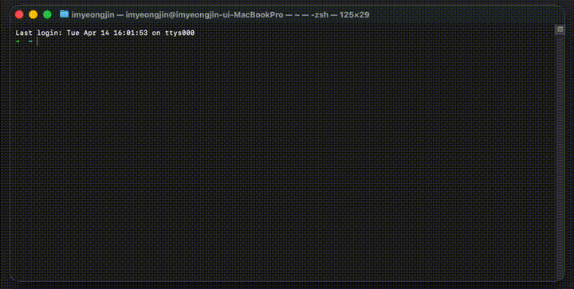

# 🐾 claude-cat

<p align="left"></p>

> **The offline-only Claude Code status line.** A cute cat tells you how much usage is left — without touching a single network endpoint.

[한국어 README →](./README.ko.md)

[](https://www.npmjs.com/package/claude-cat)
[](https://www.npmjs.com/package/claude-cat)
[](LICENSE)
[](https://nodejs.org)
[](https://packagephobia.com/result?p=claude-cat)
[](#-why-claude-cat)
[](#-why-claude-cat)
[](https://github.com/thingineeer/claude-cat/graphs/commit-activity)

<p align="center">
  
  <br />
  <em>3-row kawaii card — <code>--full --kawaii</code></em>
</p>

## 🛡️ Why claude-cat

claude-cat only renders the JSON that Claude Code **already pipes to
statusLine scripts via stdin**. Nothing else. That's the whole
design — and the whole safety story:

- **🚫 Zero network calls.** No `api.anthropic.com`. No
  `claude.ai`. No `/api/oauth/usage`. Run it behind a firewall; it
  works the same. `tcpdump` stays empty.
- **🚫 Zero credential reads.** Never touches
  `~/.claude/.credentials.json`, the macOS Keychain, or any OAuth
  token. If your npm account is ever compromised, the worst case
  is a funny-looking status line — not a leaked Anthropic account.
- **🚫 Zero outbound writes.** Only writes to
  `~/.claude/claude-cat/` (a local sync cache + optional debug
  dumps). Nothing leaves your machine.
- **✅ Stdin-only**, by policy. Documented in
  [`SECURITY.md`](./SECURITY.md) and enforced by the project's
  threat model — not a side effect.

### Compared to other Claude Code status-line / usage tools

| Feature | **claude-cat** | ccstatusline | claude-dashboard | ccusage |
| --- | :---: | :---: | :---: | :---: |
| Runs on every statusLine render | ✅ | ✅ | ✅ | ❌ (CLI) |
| **No network calls** | **✅** | ❌ (Anthropic API) | ❌ (Anthropic API) | 🟡 (pricing fetch, `--offline` ok) |
| **No OAuth / credential reads** | **✅** | ❌ | ❌ | ✅ |
| Kawaii cat moods 😺 | ✅ | ❌ | ❌ | ❌ |
| Cross-terminal sync | ✅ | ❌ | ❌ | n/a |
| Historical / cost reports | ❌ | 🟡 | ✅ | ✅ |

**Pick claude-cat when** you want a friendly always-on status line
and you care that your toolchain isn't quietly talking to Anthropic
behind your back. **Pair with [`ccusage`](https://github.com/ryoppippi/ccusage)**
if you also want on-demand cost reports — the two are complementary
(claude-cat for live render, ccusage for analysis).

> "Just a cat" isn't a cute tagline — it's the threat model.

## Install

### Quick setup (recommended)

Run the interactive wizard — it walks you through layout, cat theme,
refresh interval, and plan in 30 seconds:

```bash
npx -y claude-cat@latest configure
```

<p align="center">
  
</p>

It writes `~/.claude/settings.json` for you (with a diff preview
first, leaving every other setting untouched). Restart Claude Code
and the line shows up on the next turn.

### Manual setup (paste a prompt)

Pick a mode, paste the prompt into Claude Code, and it edits
`~/.claude/settings.json` for you.

### A) ⭐ Default — compact, one line *(recommended)*

You get a single line: usage bars + `$` cost + `ctx %`. No cat. Wraps
on narrow terminals.

```
5h ▓▓▓▓░░░░░░ 47% (1h 19m) | week ▓▓▓░░░░░░░ 31% (Fri 1pm) | $37.37 | ctx 20%
```

```text
Install claude-cat (https://github.com/thingineeer/claude-cat) into my
~/.claude/settings.json as the statusLine.

- type: "command"
- command: "npx -y claude-cat@latest"
- padding: 0
- refreshInterval: 300

Don't touch any other key. Show me the diff first.
```

### B) 3-row kawaii cat

You get a 3-row card: ASCII cat on the left, data rows on the right.
The cat's face and prop change with your usage.

```
 /\_/\    Opus 4.6  ·  $38.52  ·  ctx 23% used (77% left)
( ^ω^ )   Current session            ▓▓▓▓▓▓░░░░░░░  51% · 1h 15m
 / >🍣    Current week (all models)  ▓▓▓░░░░░░░░░░  31% · Resets Apr 17, 1pm
```

```text
Install claude-cat (https://github.com/thingineeer/claude-cat) into my
~/.claude/settings.json as the statusLine.

- type: "command"
- command: "npx -y claude-cat@latest --full --kawaii"
- padding: 0
- refreshInterval: 300

Don't touch any other key. Show me the diff first.
```

<details>
<summary>All modes at a glance</summary>

Same install pattern — just swap the `command` value.

<table>
<thead>
<tr><th>flag</th><th>command</th><th>preview</th></tr>
</thead>
<tbody>
<tr>
<td><strong>⭐ (default)</strong></td>
<td><code>npx -y claude-cat@latest</code></td>
<td><pre>5h ▓░░░░░░░░░ 10% (3h 21m) | week ▓▓░░░░░░░░ 18% (Fri 1pm) | $0.123</pre></td>
</tr>
<tr>
<td><code>--full --kawaii</code></td>
<td><code>npx -y claude-cat@latest --full --kawaii</code></td>
<td><pre> /\_/\   Opus 4.6 · $0.123
( ^ω^ )  session  ▓░░░░░░░░░░░░░ 10% · 3h 21m
 / >🍣   week     ▓▓▓░░░░░░░░░░░ 18% · Resets Apr 17, 1pm</pre></td>
</tr>
<tr>
<td><code>--full</code></td>
<td><code>npx -y claude-cat@latest --full</code></td>
<td><pre>/ᐠ ^ᴥ^ ᐟ\  Opus 4.6 · $0.123
session  ▓░░░░░░░░░░░░░ 10% · 3h 21m
week     ▓▓▓░░░░░░░░░░░ 18% · Resets Apr 17, 1pm</pre></td>
</tr>
<tr>
<td><code>--wide</code></td>
<td><code>npx -y claude-cat@latest --wide</code></td>
<td><pre>5h ▓░░░░░░░ 10% (3h 21m) | week ▓░░░░░░░ 18% (Fri 1pm) | $0.123</pre></td>
</tr>
<tr>
<td><code>--full --no-cat</code></td>
<td><code>npx -y claude-cat@latest --full --no-cat</code></td>
<td><pre>Opus 4.6 · $0.123
session  ▓░░░░░░░░░░░░░ 10% · 3h 21m
week     ▓▓▓░░░░░░░░░░░ 18% · Resets Apr 17, 1pm</pre></td>
</tr>
</tbody>
</table>

Power-user flags: `--stack=auto|always|never`, `--max-cols=<n>`,
`--no-debug-chip`, `--icons=none|emoji|nerd`. Env vars:
`CLAUDE_CAT_COLUMNS`, `CLAUDE_CAT_DEBUG=1`,
`CLAUDE_CAT_PLAN=pro|max|auto` (Pro users: set `pro` to hide weekly
bars — the wizard sets this automatically).

</details>

## Reading the output

```
5h ▓▓▓▓░░░░░░ 47% (1h 19m) | week ▓▓▓░░░░░░░ 31% (Fri 1pm) | $37.37 | ctx 20%
```

| chip | meaning |
| ---- | ------- |
| `5h` / `week` / `sonnet` | rate-limit window (5-hour session / weekly / per-model weekly) |
| `▓▓▓▓░░░░░░` | 10-cell progress bar — green → yellow → red as it climbs |
| `47%` | exact percentage |
| `(1h 19m)` / `(Fri 1pm)` | time until that window resets — relative for session, absolute for weekly |
| `$37.37` | **this Claude Code session's running cost in USD** — see below |
| `ctx 20%` | how full the current conversation's token budget is |

### What `$37.37` is — and isn't

It's **this single Claude Code session's running cost**, computed by
Claude Code itself (`cost.total_cost_usd` from stdin JSON).

- ❌ NOT "Extra usage" plan-overage fees — that's a different
  `/usage` popup bar and isn't piped to statusLine scripts.
- ❌ NOT your monthly subscription bill.
- ❌ NOT money leaving your account right now if you're on Pro/Max
  (those are flat-rate — the number is informational).
- ✅ On an **API key** it's the real cost. On **Bedrock / Vertex**
  it stays `$0.00` (Claude Code can't compute cost there).

## Cat moods

The cat only shows up in `--full` modes. Six moods — five driven by
usage, one state-driven (resting).

| trigger | `--full` (1-line face) | `--full --kawaii` prop |
| ------- | ---------------------- | ---------------------- |
| no rate limits yet (*resting*) | `/ᐠ -ᴥ- ᐟ\` | 🚬 smoke |
| 0–30 % (*chill*) | `/ᐠ ^ᴥ^ ᐟ\` | 🍣 sushi |
| 30–60 % (*curious*) | `/ᐠ •ᴥ• ᐟ\` | ⌨️ keyboard |
| 60–85 % (*alert*) | `/ᐠ ◉ᴥ◉ ᐟ\` | ☕ coffee |
| 85–95 % (*nervous*) | `/ᐠ ⊙ᴥ⊙ ᐟ\` | 💤 break |
| 95 %+ (*critical*) | `/ᐠ ✖ᴥ✖ ᐟ\` | 🛌 sleeping |

Mood policy: `weekly ≥ 60 %` or `session ≥ 75 %` → alert; any
window ≥ 85 → nervous; any ≥ 95 → critical. Weekly drives the mood
because it's the bar that actually constrains your week.

<details>
<summary>Full 3-row ASCII gallery for every mood</summary>

**resting**
```
 /\_/\
( -.-)
 / >🚬~
```

**chill** (0–30 %)
```
 /\_/\
( ^ω^ )
 / >🍣
```

**curious** (30–60 %)
```
 /\_/\
( •ㅅ•)
 / >⌨️
```

**alert** (60–85 %)
```
 /\_/\
( -ㅅ-)
 / づ☕
```

**nervous** (85–95 %)
```
 /\_/\
( xㅅx)
 / づ💤
```

**critical** (95 %+)
```
 /\_/|
( -.-)zzZ
 /   \
```

</details>

## Plan compatibility

| Plan | Shows | Notes |
| ---- | ----- | ----- |
| Claude Pro / Max | rate-limit bars, reset countdown, cat mood, session cost | `rate_limits` appears after first reply |
| Anthropic API key | session cost in USD + cat mood | no rate_limits in stdin JSON |
| Bedrock / Vertex | cost stays at `$0.00` | upstream limitation |

## What's *not* in stdin JSON (yet)

Two things `/usage` popup shows but Claude Code doesn't pipe to
statusLine scripts, so claude-cat can't render them today:

- **Current week (Sonnet only)** — server includes
  `rate_limits.seven_day_sonnet` only sometimes (condition undocumented).
- **Extra usage** (e.g. `$14 / $20 spent`) — comes from
  `/api/oauth/usage` (private endpoint).

A future opt-in daemon could proxy that endpoint locally and cache
values. Tracked in [issues](https://github.com/thingineeer/claude-cat/issues).

## Security

claude-cat is deliberately small and network-free so it fits
Claude Code's per-message hot path safely.

**What it does** — reads the stdin JSON Claude Code already pipes to
statusLine scripts, prints a colored line.

**What it doesn't do** — no network requests, no credential reads, no
keychain access, no writes outside `~/.claude/claude-cat/`. The
invariants are listed in [SECURITY.md](./SECURITY.md).

### npm supply-chain considerations

`npx -y claude-cat@latest` downloads and runs the latest published
version every time. This is standard for npm but worth knowing:

- **Pin if you want reproducibility** — `npx -y claude-cat@1.2.4`
  instead of `@latest`. Upgrade when an advisory is published.
- **Review the package** — the published tarball only ships `bin/`,
  `src/`, `examples/`, and README/LICENSE (`files` in `package.json`).
  You can audit it before install: `npm pack claude-cat && tar -tf
  claude-cat-*.tgz`.
- **Local install alternative** — clone the repo and point your
  statusLine at `node /path/to/claude-cat/bin/cli.js`. No npm fetch
  at all.

### Reporting a vulnerability

Private advisory only:
**https://github.com/thingineeer/claude-cat/security/advisories/new**

Don't open a public issue. See [SECURITY.md](./SECURITY.md).

## Development

```bash
git clone https://github.com/thingineeer/claude-cat.git
cd claude-cat
git config core.hooksPath .githooks

npm run test:sample    # try a fixture
npm run test:full
```

Contributing guide: [CONTRIBUTING.md](./CONTRIBUTING.md). For
Claude-Code sessions: [CLAUDE.md](./CLAUDE.md).

## License

MIT © thingineeer
